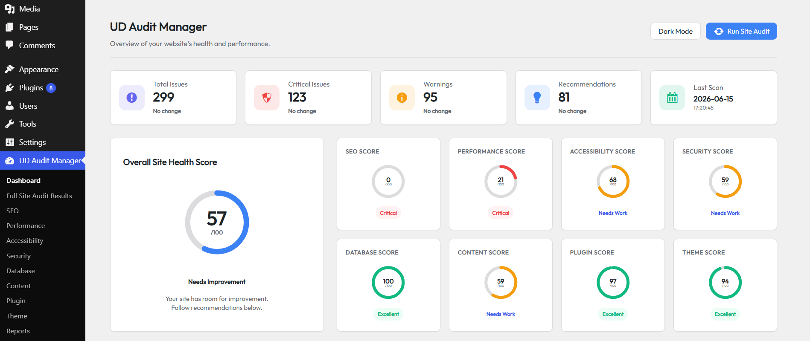
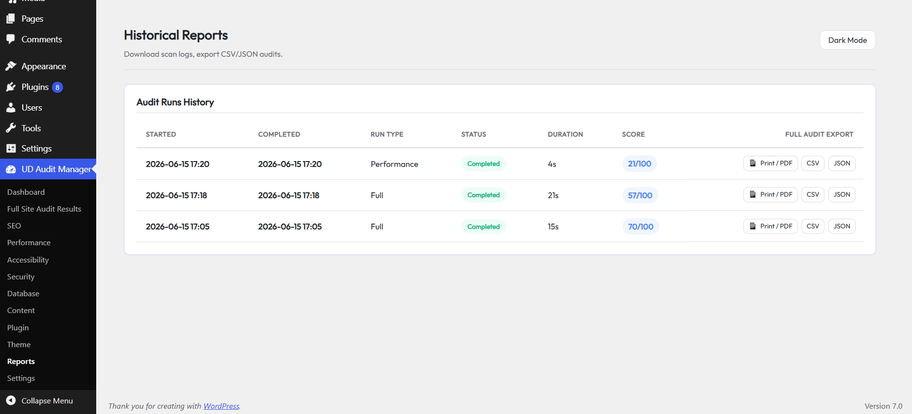

# UD Audit Manager

### WordPress Website Audit & Health Analysis Plugin

**UD Audit Manager** is a modern, modular, and privacy-first site health diagnostic system designed to perform in-depth local website auditing. Executed entirely on your local web server, it scans your site's files, configurations, templates, and database records to identify optimization opportunities, security weaknesses, and accessibility violations, and ranks them inside a dedicated **Priority Fix Center** to help maximize your site's health index score.

Unlike external site auditors that run heavy network crawlers, require paid subscriptions, or transmit telemetry data, UD Audit Manager respects your server's resources and guarantees 100% data privacy.

---

## Features

- **Local Scan Coordinator**: Audits your environment, database overheads, active themes, and plugins from the server context without outbound telemetry calls.
- **Priority Fix Center**: Ranks all discovered issues based on their potential score recovery, grouping them by complexity so you can focus on quick database cleans or manual theme tweaks.
- **Eight Specialized Modules**: Multi-point diagnostics covering SEO, Performance, Security, Accessibility, Database, Content Quality, Plugins, and Themes.
- **Interactive Health Dashboard**: Modern responsive UI with CSS-animated progress displays, dynamic SVG metrics rings, and dark mode styling.
- **Comprehensive Reports Exporter**: Export audit runs to PDF summaries, structured CSV files, or raw developer-friendly JSON schemas.

---

## Screenshots

### Dashboard Overview

### Reports

---

## Requirements

To run UD Audit Manager, your environment should meet the following minimum specifications:

- **WordPress Version**: 6.5 or higher
- **PHP Version**: 8.0 or higher (with standard `curl` and `mbstring` extensions)
- **MySQL Version**: 5.7 or higher (or MariaDB 10.3+)

---

## Installation

### Method 1: WordPress Admin Upload
1. Download the plugin zip file (`ud-audit-manager.zip`) from the release assets page.
2. Go to your WordPress Dashboard, navigate to **Plugins > Add New Plugin**, and click **Upload Plugin**.
3. Select the `ud-audit-manager.zip` file and click **Install Now**.
4. Click **Activate Plugin**.
5. Follow the **Setup Wizard** to perform compatibility checks and select default modules.

### Method 2: Manual Installation (FTP/SFTP)
1. Download the plugin release archive and extract the contents to a folder named `ud-audit-manager`.
2. Upload the `ud-audit-manager` directory to your WordPress server's `/wp-content/plugins/` folder using your FTP client.
3. Log into your WordPress Dashboard, navigate to **Plugins > Installed Plugins**, and click **Activate** under **UD Audit Manager**.
4. Follow the onboarding **Setup Wizard** sequence.

---

## Usage

### 1. Running an Audit
Upon completing the Setup Wizard, you will be redirected to the main dashboard. Click the **Run Site Audit** button in the top right corner. The scan runs asynchronously, showing you the exact module currently executing in real-time.

### 2. Reading Results
Once finalized, the dashboard updates with your overall **Health Score (0-100)** and a breakdown of findings:
- **Priority Fixes**: High-impact issues that can be optimized quickly (some support automated 1-click fixes).
- **Category Summary**: Click on any audit category (e.g. SEO, Security) to drill down into specific results.

### 3. Understanding Severity Levels
Issues are categorized into four severity tiers:
- 🔴 **Critical**: Serious security flaws or critical sitemap errors that require immediate resolution.
- 🟠 **High**: Major performance bottlenecks or layout shifts (CLS) that negatively affect users.
- 🟡 **Medium**: Standard rules violations (like missing alt tags or post revisions bloat).
- 🔵 **Low**: Best practice recommendations, warning metrics, or minor optimization hints.

### 4. Exporting Reports
Navigate to **Audit Reports** in the plugin submenu. Next to any completed scan run, you will find options to:
- Generate a print-ready **PDF report** layout.
- Export findings to a **CSV sheet** for external analysis.
- Download a **JSON file** containing full diagnostic schemas.

---

## Audit Modules

### SEO Audit
Analyzes meta descriptions, title formats, head tags structure, XML sitemaps registration, search engine visibility settings, and canonical URLs.

### Security Audit
Verifies WordPress debugging switches, administrative roles, file editor restrictions, directory indexing permissions, and core/plugin update vectors.

### Performance Audit
Evaluates asset footprints, image width/height attributes, browser cache rules, Gzip compression status, and media lazy loading.

### Accessibility Audit
Tests WCAG structural elements, heading hierarchy orders, link descriptive titles, form labels bindings, and ARIA markup compliance.

### Database Audit
Checks table overhead bloat, counts database transients, scans junk post revisions, and measures autoload metadata size.

### Content Audit
Monitors article word sizes, categorizations, tag distributions, and empty taxonomy parameters.

### Plugin Audit
Analyzes the active plugin count, inactive scripts footprint, and enqueued stylesheet weight to identify potential performance impact.

### Theme Audit
Validates favicon presence, site logo customizers, active themes, and parent/child template configurations.

---

## FAQ

### What does UD Audit Manager do?
It is a comprehensive, local website auditing plugin. It evaluates your site's SEO, Performance, Security, Database size, Accessibility, Content Quality, Active Plugins, and Themes, and provides a clear Priority Fix dashboard to address issues.

### Does it affect site performance?
No. Scans run asynchronously in small batches, respecting database queries. This keeps server CPU loads minimal.

### Can I export reports?
Yes. Supported export formats include clean CSV sheets, raw developer JSON structures, and print-ready PDF summaries.

### Does it modify my website?
No. UD Audit Manager is a diagnostic scanner. It only reads data. The only database write action occurs when you explicitly click a button to clean transients or revisions in the Priority Fix Center.

### Is it beginner friendly?
Yes. The Priority Fix Center organizes issues by priority, explaining "Why It Matters" and providing clear "How To Fix" steps for every recommendation.

---

## Roadmap

- **Additional Audit Checks**: Add diagnostic checks for PHP configurations, HTTP/2 usage, and local server memory caps.
- **More Export Formats**: Add HTML reports and email summaries support.
- **More Performance Analysis**: Add advanced asset parsing to detect redundant CSS or JS files.
- **Extended Reporting**: Add custom email alerts and notification integrations.

---

## Changelog Summary

### Version 1.0.0
- Initial public release.
- Eight audit modules: SEO, Performance, Accessibility, Security, Database, Content, Plugins, Themes.
- Automated Priority Fix Center with 1-click optimization tools.
- PDF, CSV, and JSON exporters.
- Setup wizard requirements checks.

---

## Support

If you encounter any bugs, have questions, or wish to suggest new diagnostic checks:
- Please open a new issue on our **GitHub Issues** page.
- Review our [Contributing Guidelines](CONTRIBUTING.md) to submit pull requests or feature request requests.

---

## License

This project is licensed under the GPL v2 or later. See the [LICENSE](LICENSE) file for details.
